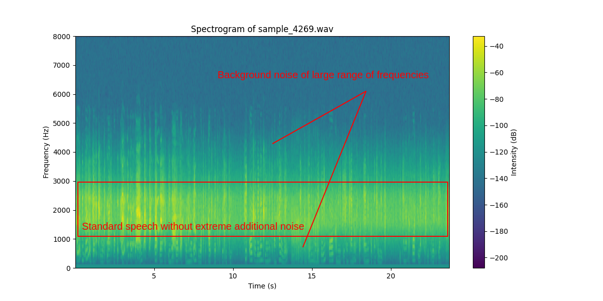
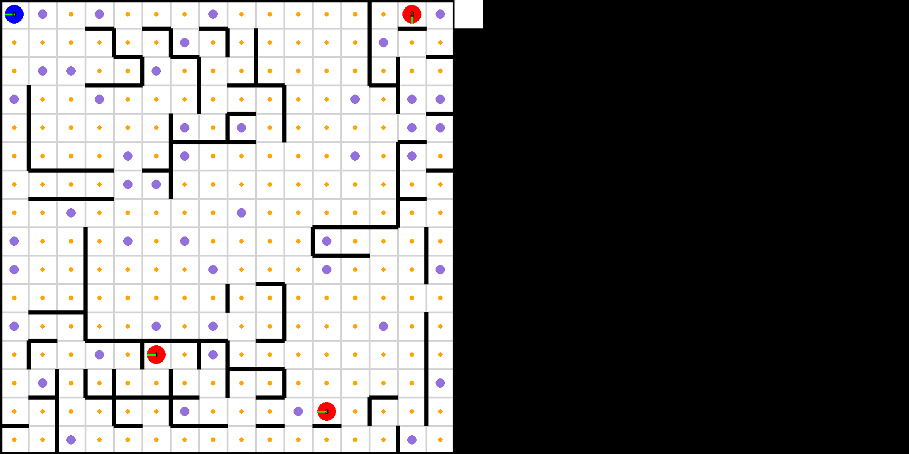

# DSTA BrainHack TIL-AI 2025 - Team DeepSheet

<!-- TOC -->
* [Introduction](#introduction)
* [Team Members (in alphabetical order)](#team-members-in-alphabetical-order)
* [Achievements](#achievements)
* [Evaluation Results](#evaluation-results-pre-semi-finals)
* [ASR](#asr)
  * [Exploratory Data Analysis](#exploratory-data-analysis-eda)
  * [Denoising](#denoising)
  * [Training](#training)
    * [Training Attempt (Whisper, Denoising)](#training-attempt-whisper-denoising)
    * [Training (Parakeet)](#training-parakeet)
  * [Hyperparameters](#hyperparameters)
  * [Inference](#inference)
  * [Additional Steps to Improve](#additional-steps-to-improve)
* [CV](#cv)
  * [Summary of Results](#summary-of-results)
  * [Data Augmentation](#data-augmentation)
  * [Potential SAHI Usage](#potential-sahi-usage)
  * [Two-Stage Approach](#two-stage-approach)
  * [Freeze Points](#freeze-points)
  * [Data Generation](#data-generation)
  * [Best Single Model](#best-single-model)
  * [Weighted Boxes Fusion (WBF)](#weighted-boxes-fusion-wbf)
  * [Potential Improvements](#potential-improvements)
* [OCR](#ocr)
  * [Preprocessing](#preprocessing)
  * [Postprocessing](#postprocessing)
  * [Models Tried](#models-tried)
  * [Training](#training-1)
  * [Qualifiers Method](#qualifiers-method)
* [RL](#rl)
  * [Remote RL Repositories](#remote-rl-repositories)
  * [Key Concepts in RL Planning](#key-concepts-in-rl-planning)
  * [The "Two-Turn" Separation Idea](#the-two-turn-separation-idea)
    * ["One-Turn" Separation](#one-turn-separation)
    * ["Two-Turn" Separation](#two-turn-separation)
  * [Deadends](#deadends)
  * [Breadcrumb Trails](#breadcrumb-trails)
  * [Algorithmic Scout Models](#algorithmic-scout-models)
  * [Algorithmic Guard Models](#algorithmic-guard-models)
  * [Deep RL](#deep-rl)
  * [Overall Analysis](#overall-analysis)
  * [Qualifiers Method](#qualifiers-method-1)
* [Surprise Task](#surprise)
  * [Initial Exploration](#initial-exploration)
  * [Analysis](#analysis)
    * [Mean Squared Error (MSE)](#mean-squared-error-mse)
    * [Structural Similarity Index Measure (SSIM)](#structural-similarity-index-measure-ssim)
    * [Comparison](#comparison)
  * [Initial naive implementation of SSIM](#initial-naive-implementation-of-ssim)
  * [Beam Search](#beam-search)
    * [Composite Similarity Matrix](#composite-similarity-matrix)
    * [Conducting Beam Search and Path-Pruning](#conducting-beam-search-and-path-pruning)
  * [Travelling Salesman Problem (TSP)](#travelling-salesman-problem-tsp)
  * [Putting it all together](#putting-it-all-together)
  * [C++ Implementation](#c-implementation)
* [Hardware used](#hardware-used)
* [Final words](#final-words)
<!-- TOC -->

## Introduction
TIL-AI 2025 comprised of 3 standard tasks, 1 surprise task (introduced on day 1 of the semi-finals, with approximately 12 hours to complete the task) and an overarching reinforcement learning (RL) task:
* **Automatic Speech Recognition (ASR)** \
    Convert noisy, accented audio into a text transcript.
* **Computer Vision (CV)** \
    Detect and classify (sometimes) small objects in a noisy image, with classes chosen from a known, target list.
* **Optical Character Recognition (OCR)** \
    Transcribe text from a noisy image of a document with varied fonts and layouts.
* **Shredded Document Reconstruction (Surprise Task)** \
    Reorder image slices of equal width from a shredded text document into their original order. 

For reinforcement learning (RL), the aim was to drive a TurtleBot3 Burger through a simulated maze environment, interacting with other agents and completing challenges.

Each match is played by four teams, and consists of four rounds, such that each team will play a scout once, and guards three times [^1]. 

As a scout, the aim is to:

* Avoid capture by the guards (-500 points),
* Collect reconnaissance points (80% distribution) placed around the map (+10 points), and
* Complete challenges located at mission points in the map (up to +50 points for semi-finals and finals, guaranteed +50 points for qualifiers).

At mission points (for semi-finals and finals), a scout will receive 5 missions, chosen from the above 4 tasks with equal probability. You can receive any where from 0 to 10 points for each task, corresponding to the accuracy of your model for the given task.

As a guard, the aim is to capture the scout (+500 points).

[^1]: The points mentioned are 10 times that used in qualifiers, and the abovementioned point distribution was used for semi-finals and finals.

### Additional Note

When using this repository, you will need to initialize git submodules, using 

```
git submodule update --init
```

## Team Members (in alphabetical order)
* [Jiang Xinnan](https://github.com/jxinnan): RL
* [Lim Dillion](https://github.com/dillionlim): ASR / RL / Surprise
* [Ng See Jay](https://github.com/CJBuzz): OCR / RL
* [Xie Kai Wen](https://github.com/XieKaiwen): OCR / RL / Surprise
* [Zhou Hao Ren](https://github.com/haoren-zhou): CV / Surprise

## Achievements
* 1st overall in Qualifiers
* Surprise Challenge Winner

In this format, a single round was conducted to decide the winner in each bracket.

We theorize that our subpar semi-finals showing was due to the fact that:

1. There was a bug in the guard algorithm in the 2nd round.
2. We prioritised a low-risk strategy with the focus being primarily on preventing the scout from getting caught. This led to the scout being unwilling to take riskier paths down narrow corridors where more missions and recon points could be gathered, resulting in a lower score.

## Evaluation results (Qualifiers)
| Task | Model | Accuracy score | Speed Score |
|-|-|-|-|
| ASR | parakeet-tdt-0.6b-v2 | 0.952 | 0.939 |
| CV | TODO | 0.532 | 0.947 |
| OCR | PaddleOCR [^2] | 1.000 | 0.941 |

## Evaluation results (Pre-semi-finals)
| Task | Model | Accuracy score | Speed Score |
|-|-|-|-|
| ASR | parakeet-tdt-0.6b-v2 (Unchanged) | 0.952 | 0.939 |
| CV | TODO | 0.615 | 0.892 [^3] |
| OCR | DocTR | 0.981 | 0.841 |
| Surprise | TSP-SSIM (Low-N-Regime) + Beam Search-SSIM (High-N-Regime) [^4] | 1.000 | 0.965 |

It is interesting to note that the reinforcement learning scores will not be introduced here, because the variance in scores would be very high between different submissions. Strategies to mitigate this during qualifiers and semi-finals/finals respectively would be discussed in the RL section.

[^2]: This was achieved via an unconventional technique, which will be elaborated on, [below](#qualifiers-method), hence, the semi-final model would be significantly different.
[^3]: This was achieved using hardware-specific TensorRT optimizations. However, since semi-final participant servers were built on a 5070Ti architecture, which we do not have access to, we ended up switching to a Pytorch implementation with a slightly lower, but comparable speed score.
[^4]: C++ and Python implementations ended up having the exact same accuracy / speed combination, to 3 significant figures.

---

## ASR

As with all previous iterations of BrainHack TIL-AI, ASR has traditionally always been one of the given tasks. However, the ASR task this year, commendably, seems to be significantly noisier, leading to a wider spread of scores.

### Exploratory Data Analysis (EDA)

Sampling a few `.wav` files from the dataset, it was noted that the input was significantly noisier.

We shall look at 2 different samples that we used for EDA to understand the samples that we are working with.


*Sample 3890 Spectrogram (sample_3890.wav in advanced dataset)*

This case was (unfortunately) one of the first samples that we looked at, and it is likely on the harder side of samples provided.

As we can see, there is a high-frequency noise in the spectrogram (corresponding to a rooster's crowing), which entirely drowns out the speech to the human ear. Unfortunately, this high-frequency noise also overlaps with the speaking frequency (which seems to have a larger range of frequencies than normaly expected, likely due to the background noise added in).


*Sample 4269 Spectrogram (sample_4269.wav in advanced dataset)*

This is a more representative sample of the normal input speech, which just consists of a speech with a distinct, narrow band of frequencies, and a large range of background noise, which is much weaker in intensity compared to the main speech. 

### Denoising

Based on the above, there was first an attempt done to get the normal range of frequency of human voices to do aggressive denoising. According to [research](https://www.researchgate.net/publication/235008404_Studying_audition_in_fossil_hominins_A_new_approach_to_the_evolution_of_language?_tp=eyJjb250ZXh0Ijp7ImZpcnN0UGFnZSI6Il9kaXJlY3QiLCJwYWdlIjoiX2RpcmVjdCJ9fQ), the [normal human speech frequency range for intelligibility lies between 300 to 3000 Hz](https://www.researchgate.net/figure/The-modern-human-audiogram-and-speech-frequencies-The-solid-line-represents-the-minimum_fig4_235008404), but the fundamental frequency for males typically ranges from 90 to 155 Hz, while for females, it ranges from 165 to 255 Hz. However, from quick testing, it appears that normal speech tends to lie up to 1400 Hz (if the dataset is non-adverse).

There were two main ways that were used to do denoising, the first being [spectral gating with the `noisereduce` library implementation, default hyperparameters](https://github.com/timsainb/noisereduce) and the second being a low-pass filter over the dataset, using a straightforward FFT implementation. 

Spectral gating was the less aggressive approach, but failed to denoise instances such as sample 3890. We then attempted to do a low-pass filter over the input. While it managed to get rid of the high-frequency noise, it gets rid of a lot of critical information since the speech band largely overlaps with the high-frequency noise, which hurts the training, even though the speech is now audible to a human ear. 

This can be seen in the FFT spectrum of samples 3890 and 4490, where there cannot be a clean cutoff between noise and speech.


*Sample 3890 FFT (sample_3890.wav in advanced dataset)*


*Sample 4490 FFT (sample_4490.wav in advanced dataset)*

This would be clear when we ended up training it on a denoised dataset.

### Training

#### Training Attempt (Whisper, Denoising)

We tried denoising the given data, then training on the original noisy dataset combined with denoised data. However, the model ended up not performing very well, as with last year. In fact, the denoised data performed worse.

Other than that, Whisper did not show much promise, only scoring slightly less than 0.9 with finetuning, and would likely score in the low 0.9s even with more hyperparameter tuning and training.

| Model | Hyperparameters and Information | Score | Speed |
|-|-|-|-|
| whisper-base.en | First 4000 samples (no denoised), 2000 steps, denoising before evaluation | 0.218  | 0.285  | 
| whisper-base.en | First 4000 samples | 0.873 | 0.857 |
| whisper-base.en | 4500 samples + denoised | 0.852 | 0.855 |
| whisper-small | 4500 samples, 2000 steps, no denoising | 0.899  | 0.594  |
| whisper-small.en | First 4000 samples, K-Fold cross validation, K = 5 | 0.895  | 0.617  |

At this point, we noticed that Whisper was not doing as well as expected, so we went onto the HuggingFace Open ASR leaderboard.

Some relevant comparisons that we looked at are reproduced below for convenience:

| Model | Average WER | RTFx | 
| - | - | - |
| nvidia/parakeet-tdt-0.6b-v2 | 6.05 | 3386.02 |
| distil-whisper/distil-large-v3.5 | 7.21 | 202.03 |
| openai/whisper-large-v3 | 7.44 | 145.51 |
| openai/whisper-small.en | 8.59 | 268.91 |

Other ASR Models in the NVIDIA parakeet family have been omitted, because at that point, Parakeet TDT 0.6B V2 had both the lowest average WER and the highest RTFx [^5].

[^5] At the point of writing this writeup, there has been a new model, ibm-granite/granite-speech-3.3-8b which has an average WER of 5.85, which is lower than the model used. However, the RTFx is 31.33, which is about 100 times lower than that of the chosen Parakeet model. This model was released on May 16 2025, but we did not use it when we noticed it before the semi-finals because of the low RTFx, given that the 25% speed score was quite significant. 

#### Training (Parakeet)

Based on initial training on Parakeet, it was fairly robust to noise, we decided not to proceed with any further augmentations. Also, drawing from above experiences, we made the decision to not train with denoising.

The preliminary testing for hyperparameter (epoch only) tuning were:

| Hyperparameters and Information | Score | Speed |
|-|-|-|
| First 4000 samples | 10 epochs raw | 0.936  | 0.929 |
| First 4000 samples, batch inference | 10 epochs raw | 0.936  | 0.936 |
| First 4000 samples for 10 epochs, 4500 samples for 2 more epochs | 0.914 | 0.94 |
| First 4000 samples for 10 epochs, 4500 samples for 1 more epoch | 0.895 | 0.943 |

Then, the actual training yielded:

| Hyperparameters and Information | Score | Speed |
|-|-|-|
| 4500 samples for 2 epochs      | 0.882 | 0.939 |
| 4500 samples for 6 epochs      | 0.911 | 0.941 |
| 4500 samples for 7 epochs      | 0.877 | 0.941 |
| 4500 samples for 8 epochs      | 0.899 | 0.941 |
| 4500 samples for 9 epochs      | 0.924 | 0.941 |
| 4500 samples for 10 epochs     | 0.949 | 0.940 |
| 4500 samples for 11 epochs     | 0.938 | 0.936 |
| 4500 samples for 12 epochs     | 0.952 | 0.939 |
| 4500 samples for 14 epochs     | 0.932 | 0.941 |

In terms of a graph for the score against epochs, it looks like


Comparing this graph against [team 2B3Y's tuning](https://github.com/ThePyProgrammer/til-25-2b3y/tree/main/asr) yielding 0.98 on the hidden set, it is likely that 12 epochs was still underfitted, but no attempt was made to further improve the score due to time constraints.

### Hyperparameters

Hyperparameters:

* Learning rate: 1e-5
* Warmup: 500 steps
* Epochs: 12
* Optimizer: Adam
* Scheduler: Cosine Annealing
* min_lr: 1e-5
* warmup_steps: 500
* adam_beta1: 0.9
* adam_beta2: 0.999
* weight_decay: 1e-5

A train / validation split of 0.9 / 0.1 was used.

### Inference

The only optimization done was to conduct batch inference in batches of 4 (since it was likely that the endpoint was called with a batch of 4 in qualifiers).

### Additional Steps to Improve

* Batching tensors instead of dumping temporary `.wav` files could have been used, however, in the limited time to do ASR experiments, we could not get batch inference on tensors to work, but [team 2B3Y's inference manager](https://github.com/ThePyProgrammer/til-25-2b3y/tree/main/asr) shows how it can be done.
* Spell checking with standard models or sanity checking with a LLM were considered, however, it was deemed that they would decrease the speed score too much, and were therefore not used. 
* It might be interesting to attempt to train it on a denoised dataset to see the results, or implement k-fold cross validation to improve robustness.

---

## CV

The CV task was a simple object detection task, with objects from [18 pre-defined classes](https://github.com/til-ai/til-25/wiki/Challenge-specifications#target-list). The training dataset provided included 20000 landscape JPEG images of dimensions `1920×1080`.

### Summary of Results

| Model | Hyperparameters and Information | Score | Speed |
| - | - | - | - |
| YOLOv8m (Qualifiers) | freeze points at freeze=8,0 | 0.532 | 0.947 |
| YOLOv8m | freeze=10,6,3,0 | 0.578 | - |
| YOLOv8l (Best single model) | see [best single model](#best-single-model) | 0.584 | 0.853 (before optimizations) |
| Weighted Boxes Fusion | 4 model ensemble (see [WBF](#weighted-boxes-fusion-wbf)) | 0.615 | 0.892 |
| Weighted Boxes Fusion (Semi-finals) | 3 model ensemble used in semi-finals | 0.609 | 0.859 |

### Data Augmentation

It is interesting to note that while the provided training data for ASR and OCR already included various forms of noise that was (assumed to be) representative of the hidden test set, the CV data provided was clean, even though the test set was known to contain noise. As such, we used data augmentation during training.

We used the following augmentations for all finals models training:

```python
T = A.Compose([
    A.GaussNoise(var_limit=2500, p=0.5),
    A.ISONoise(p=0.5),
    A.Blur(p=0.15),
    A.MedianBlur(p=0.15),
    A.ToGray(p=0.1),
    A.CLAHE(p=0.15),
    A.RandomBrightnessContrast(p=0.6),
    A.RandomGamma(p=0.2),
    A.ImageCompression(quality_lower=75, p=0.5),
])
```

### Potential SAHI Usage

Moreover, the objects were small relative to the size of the image, which increased detection difficulty. In theory, [SAHI](https://github.com/obss/sahi) would have been an effective technique to improve detection accuracy. However, we did not manage to improve our score using it, likely due to an error in training data preparation (See [Potential Improvements](#potential-improvements)).

### Two-Stage Approach

We also noticed that three of the classes overlapped with the 80 COCO object categories (*car*, *bus*, *truck*), while most of the others (less *missile*, *tank*, and perhaps *helicopter*) could be considered a subclass of either *airplane* or *boat*, both of which are COCO object categories. This meant that fine-tuning a model pre-trained on the COCO dataset would yield significant benefits.

This also motivated our initial two-stage approach of first detecting superclasses (e.g. *airplane*, *boat*), then using separate image classifiers for each superclass to perform fine-grained image classification on the cropped out object, upscaled using [SwinIR-M](https://github.com/JingyunLiang/SwinIR) (realSR_BSRGAN_DFO_s64w8_SwinIR-M_x4_GAN). However, this approach proved to be worse in terms of both accuracy and speed compared to a single detection + classification model. This was likely due to the classification models tried (ResNet-50, deit-small-patch16-224) overfitting easily on the limited number of unique template objects used to generate the training data.

### Freeze Points

Models pre-trained on the COCO dataset learn many features which are transferrable to the 18 object classes in the CV task. As such, layers in the detection model backbones were frozen to preserve the learned low-level features during the initial stages of training. These layers are gradually unfrozen in later stages of training as training loss stabilises.

It is also interesting to note that simply averaging the weights of the same model, trained on the same data but at different stages of training yielded a higher accuracy that each of the individual models before averaging.

### Data Generation

A custom dataset was also generated in an effort to prevent overfitting on the training data (implemented [here](cv/data-generation/generate.ipynb)). These were the steps taken:

1. Background images and images of the targets were webscrapped using the `bing_image_downloader` library. 
2. As most images of the target objects had their own backgrounds, they were removed with the `rembg` library. 
3. The background images were resized to `1920x1080` per the training data.   
4. The objects (now with transparent background) were pasted on the background images. In the training data, air vehicles seem to be smaller in size compared to others and were harder to detect. As such, they were made to be smaller (2000-12000 pixel squares) compared to other object classes (14000-30000 pixel squares).
5. The images were augmented with the aforementioned [augmentations](#data-augmentation).  

### Best Single Model

The best score we achieved using a single model was with YOLOv8l, yielding an accuracy of $0.584$. 

The model was trained on 14000 images from the original training dataset + 4000 [self-generated synthetic images](#data-generation), all [augmented](#data-augmentation).

Freeze points at 10, 7 and 4 layers were employed before fine-tuning the fully unfrozen model.

| No. of Frozen Layers | Learning Rate | Epochs | Score |
| :-: | :-: | :-: | :-: |
| 10 | 1e-4 | 25 | 0.552 |
| 7 | 6e-5 | 11 | 0.564 |
| 4 | 3e-5 | 11 | 0.560 |
| 0 | 1e-5 | 5 | 0.570 |


By averaging the final fine-tuned weights with the weights of the model with 7 frozen layers, the resulting model achieved an accuracy of $0.584$ on the hidden test set. 

### Weighted Boxes Fusion (WBF)

We made use of [Weighted boxes fusion (WBF)](#https://github.com/ZFTurbo/Weighted-Boxes-Fusion) to ensemble the predictions of multiple models. Class agnostic Non-Maximum Suppression (NMS) was also applied as a final step to reduce the occurence of multiple bounding boxes predicted for the same object.

Below is a table of the models ensembled to achieve our highest scoring submission:

| Model | Ensemble Weight | Individual Model Score | Description |
| - | :-: | :-: | - |
| YOLOv11m | 3 | 0.518 | 8 frozen layers |
| YOLOv8m | 5 | 0.532 | Qualifiers model |
| YOLOv8m | 8 | 0.579 | Averaged weights across freeze points |
| YOLOv8l | 8 | 0.584 | See [best single model](#best-single-model) |

All models except the qualifiers YOLOv8m model were trained on the same dataset with 14000 images from original dataset + 4000 [self-generated images](#data-generation). The qualifiers model used only the original dataset with no additional data.

Inference Parameters:

* Individual models NMS `iou = 0.6`
* WBF parameters
    * `skip_box_thr = 0.10`
    * `iou_thr = 0.5`
* Class agnostic NMS `iou_thr = 0.5`
* Final confidence threshold `final_conf = 0.25`

See [cv_manager.py](cv/src/wbf/cv_manager.py) and [ensemble.py](cv/src/wbf/ensemble.py) for more details about implementation.

> Note: For semi-finals, we did not manage to get TensorRT optimizations to work in time on the 5070 Ti, hence we decided to use a 3 model ensemble without the YOLOv11m model, but with all other parameters (including ensemble weights) unchanged, using PyTorch models in half precision.

### Potential Improvements

1. Use larger models

   Due to time constraints and hardware limitations, we were unable to test out larger models. However, using a larger model like [YOLOv6-L6](https://github.com/meituan/YOLOv6) would likely have improved our CV score significantly.
   
2. SAHI

   When testing out SAHI, we used a model that was trained on cropped slices of the training images, which significantly increased false positives due to cut off objects in the training data. Instead, we should have directly used the detection models trained on the full images to perform inference on slices. Had this been done, it would likely have resulted in an increase in accuracy due to relatively small object sizes (of course, the trade-off in speed would need to be considered).

---

## OCR

The OCR task involves reading text in a scanned document. The scanned documents have different layouts and its text has different fonts. Most of the scanned documents also have some or all of the following three augmentations:

1. Salt and pepper noise
2. Blurred text
3. Mirrored 'ghost text' pasted on the original text

### Preprocessing

To handle the augmentations and the layout, all images were preprocessed using **median blur** (to remove salt and pepper noise) and **Otsu's thresholding** (to remove as much 'ghost text' as possible without degrading the original text too much). 

Final preprocessing pipeline:
```python
import numpy as np
import cv2

def preprocess(image_bytes: bytes) -> np.ndarray:
    nparr = np.frombuffer(image_bytes, np.uint8)
    img = cv2.imdecode(nparr, cv2.IMREAD_GRAYSCALE)

    # Mask to remove 'ghost text'
    blurred = cv2.GaussianBlur(img, (3, 3), 0)
    thresh, _ = cv2.threshold(blurred, 0, 255, cv2.THRESH_OTSU)
    img[img>thresh] = 255

    # Make it fLavourless 
    img = cv2.medianBlur(img, 3)

    # Resize (no idea how this helps because docTR resizes it to 1024 by 1024 anyways but it did improve score by a bit)
    img = cv2.resize(img, (0, 0), fx=0.5, fy=0.5)

    # Convert back to RGB (required by DocTR)
    img = cv2.cvtColor(img, cv2.COLOR_GRAY2RGB)
          
    return img
```

|  |  |
|:------------------------------------:|:--------------------------------------:|
| Before preprocessing                 | After preprocessing                    |


Not all of the mirrored 'ghost text' were able to be removed. As such, the text detector was fine-tuned to hopefully handle such cases.

**CLAHE** (Contrast Limited Adaptive Histogram Equalization) was tried as well to enhance constrast and **Laplacian** for edge highlighting. Although it made the text in the images look slightly clearer, the score did not improve with it. 

```python
    clahe = cv2.createCLAHE(clipLimit=2.0, tileGridSize=(8,8))
    contrast = clahe.apply(denoised)
    blurred = cv2.GaussianBlur(contrast, (0, 0), 1.0)
    sharpened = cv2.addWeighted(contrast, 1.2, blurred, -0.2, 0)

    # Edge highlighting (using Laplacian)
    edges = cv2.Laplacian(sharpened, cv2.CV_8U, ksize=3)
    img = cv2.addWeighted(sharpened, 1.0, edges, 0.2, 0)
```

**FFT Bandpass Filtering** was applied in an attempt to suppress 'ghost text' artifacts by removing specific frequency components from the image. While this method visually reduced the prominence of 'ghost text', it also had unintended side effects on the quality of the remaining text. Specifically, although the filtered image appeared clearer to the human observer, the filtering process attenuated not only the unwanted frequencies associated with the 'ghosting' but also those crucial for preserving sharp text edges and fine details. As a result, the boundaries and features of the actual characters became less distinct and effectively “smearing” or blurring the edges. This degradation in edge clarity and local contrast impaired the OCR model’s ability to accurately segment and recognize characters, leading to a measurable decrease in recognition accuracy after preprocessing with the bandpass filter. This suggests that while FFT-based filtering can target and remove certain structured noise, it could have suppress high-frequency information essential for reliable character recognition.
We implemented a soft bandpass filter because through experimenting with this preprocessing step, we observed that hard cutoffs (hard bandpass filter) will result in something that we later realise is called **ringing artifacts** known as Gibbs phenomenon when inverse FFT is performed. Hence, to reduce this we used a soft mask instead, to ensure that the transition from pass to stop bands is gradual, minimising such artifacts and producing more natural filtered images.

Below is our implementation of the FFT Bandpass Filter
```python
    def fft_bandpass_filter(self, img, low_cut=0.5, high_cut=300):
        # Ensure grayscale
        if len(img.shape) == 3:
            img = cv2.cvtColor(img, cv2.COLOR_BGR2GRAY)
        h, w = img.shape
    
        # FFT
        f = np.fft.fft2(img)
        fshift = np.fft.fftshift(f)
    
        # Create bandpass mask
        crow, ccol = h // 2, w // 2
        Y, X = np.ogrid[:h, :w]
        distance = np.sqrt((Y - crow)**2 + (X - ccol)**2)
    
        def soft_bandpass_mask(h, w, low_cut, high_cut):
            crow, ccol = h // 2, w // 2
            Y, X = np.ogrid[:h, :w]
            distance = np.sqrt((Y - crow)**2 + (X - ccol)**2)
            low_pass = np.exp(-((distance / high_cut)**2))
            high_pass = 1 - np.exp(-((distance / low_cut)**2))
            return low_pass * high_pass
    
        mask = soft_bandpass_mask(h, w, low_cut, high_cut)
    
        # Apply mask
        fshift_filtered = fshift * mask
    
        # Inverse FFT
        f_ishift = np.fft.ifftshift(fshift_filtered)
        img_back = np.fft.ifft2(f_ishift)
        img_back = np.abs(img_back)
    
        # Normalise to uint8
        img_back = np.clip(img_back, 0, 255)
        img_back = img_back / img_back.max() * 255
        img_back = img_back.astype(np.uint8)
    
        bgr_image =  cv2.cvtColor(img_back, cv2.COLOR_GRAY2BGR)
        inverted_image = cv2.bitwise_not(bgr_image)
        inverted_grayscale_image = cv2.cvtColor(inverted_image, cv2.COLOR_BGR2GRAY)
    
        return inverted_image.astype(np.uint8)
```

Conducting preprocessing using Deep Learning models such as [DocDiff](https://github.com/Royalvice/DocDiff) and [DocEnTR](https://github.com/dali92002/DocEnTR) were explored as well, mainly to better remove the 'ghost text', but we did not end up moving forward with them due to the following factors:
1. Taking the noisy images as input, these models were not good at reconstructing the denoised images out-of-the-box, and likely required extra training which greatly increased the efforts of implementing such a preprocessing step.
2. The inference speed of these models were also a problem as using them would have an adverse impact on our speed score, which might have resulted in a decrease in overall score even if the accuracy increased.

### Postprocessing

Most OCR libraries return the lines of text sorted top-down. However, as documents have 2 columns, this will return the text in the wrong order. To handle this, a simple comparison to re-order the lines was used. 

```python 
LinesData = tuple[list[int], str, float]
# (bounding boxes, text, confidence score)

def arrange_lines(line1: LinesData, line2: LinesData) -> bool:
    bbox1 = line1[0]
    bbox2 = line2[0]
    
    if bbox1[2] < bbox2[0]:
        return -1
        
    if bbox2[2] < bbox1[0]:
        return 1
    
    return bbox1[1] - bbox2[1] 
```

This will not work for more complex layouts (e.g. those found in physical newspapers).


Besides layouts, improving accuracy with a spellchecker was also considered. Transformer-based language models such as `google/flan-t5-small` proved too slow (timed out) and also posed a problem with their context-length and `max-new-tokens` limit, even inference was done in batches on the predicted text from the OCR model (split the predicted text into batches of 4 to be processed in parallel). 
A faster algorithmic method in `symspellpy` was tried. However, despite adjusting the frequency of words in the default unigram dictionary to better suit the words used in this context (operation/mission-related words), no discernable improvement was achieved. Hence, spellchecking was not incorporated. 

### Models Tried

A variety of baseline models were tried. Some such as pytesseract, surya-ocr and trocr were able to achieve decent accuracy but were extremely slow (surya-ocr timed out in the submission). 
Other models such as EasyOCR and calamariOCR were tried, but led to underwhelming and disappointing CERs (e.g. For EasyOCR many combinations of values were attempted for several parameters including, `decoder`, `contrast-ths`, `beamWidth`, but none of the combinations yielded decent results).
PaddleOCR and docTR were able to achieve high accuracy and was much faster. As docTR had higher accuracy and slightly better speed, it was used for the semi-finals.

| Detector Model | Dataset | Hyperparameters | Recogniser Model | Dataset | Hyperparameters | Score | Speed |
|:--------:|:------------:|:----------------:|:----------------:|:------------:|:----------------:|:-----:|:-----:|
| `fast_base`    | Default (preprocessed) | 10 epochs, LR 0.0001, batch size 2 | `crnn_vgg16_bn` | 3 epochs default + 3 epochs Mixedv2 | 3 epochs, LR 0.00002, batch size 256, freeze backbone + 5 epochs LR 0.00001, batch size 128, unfreeze backbone | 0.983 | 0.779 |
| `fast_base`    | Default (preprocessed) | 10 epochs, LR 0.0001, batch size 2 | `crnn_mobilenet_v3_large` | Mixedv2 | 3 epochs LR 0.00001, batch size 128, unfreeze backbone | 0.981 | 0.844 |

For the full list of models submitted, hyperparameters and evaluation scores, refer to the [model tracking google sheet](https://docs.google.com/spreadsheets/d/1AKAwwwYEBJRM5_3b5ByRxlXXl7o_wsypeeivPmWCrRI).

Default hyperparameters were used if they were not explicitly stated.

For the semi-finals, `crnn_mobilenet_v3_large` was used as it is significantly faster for only a slight dip in accuracy. 

#### Training

The text detector was fine-tuned using the full default dataset. However, as preprocessing was intended to be conducted before inference, the images in the default dataset were also preprocessed before training.

The text recogniser was initially fine-tuned with the full dataset. However, it was discovered that the number of unique ground truths for the provided dataset is quite limited (only 5 unique ground truths). To prevent overfitting, a custom dataset with text from ChatGPT was created. The generated images had text with different [fonts](ocr/doctr/train/data_prep/fonts/). They were augmented with *salt and pepper noise* and *gaussian blur* and preprocessed. The *'ghost text'* was not added as it was hoped that the preprocessing would succesfully remove most of it. This custom dataset of about 240000 words was mixed with a portion of the default dataset (about 600 out of the 4500 provided images, so about 300k out of 2.25m words) with a 80-20 train-val split to create the `Mixedv2` dataset shown above. 

For docTR, text recognition has to be fine-tuned on images of **words** while with PaddleOCR, text recognition can be fine-tuned on images of **lines/phrases**

The generation and preperation of datasets can be found in the following files:
- [docTR](ocr/doctr/train/data_prep/dataset_prep.ipynb) 
- [paddleocr](ocr/paddle/train/dataset_prep.ipynb)

### Qualifiers Method

During the qualifiers, it was discovered that the dataset provided contained only 5 ground truths. We hypothesized that the evaluation set was similar. After it was verified with a few submissions, we decided it was possible to return a fully correct answer by only conducting OCR on the first line and matching it to the closest ground truth. To speed up inferencing, we cropped the image from 200 pixels on the y-axis to $\frac{1}{6}$ of its original height. This method led to a higher accuracy and speed score for the qualifiers and is not representative of the actual model performance for OCR. The implementation of this method is found [here](ocr/paddle/srcs/src-cheese/). 

---

## RL

Read the [introduction](#introduction) again for a refresher on the RL task objectives.

### Remote RL repositories

For more detailed RL model analysis, refer to our [RL testbed repository](https://github.com/jxinnan/til-25-rl-testbed). For the simulated environment that we used to evaluate various models with convenience scripts, refer to our [RL model zoo](https://github.com/jxinnan/til-25-rl-zoo).

**Warning:** These submodules are quite large in size (~6 GB in total).

### Key Concepts in RL Planning

We shall examine a few ideas that we focused on when coming up with a solution to this task.

### The "Two-Turn" Separation Idea

In our model training, we heavily emphasised the idea of a "two-turn" separation minimum between scouts and guards. Let us examine why this is the case, in the particular case of a one-scout-one-guard-chase scenario.

On average, this would be the most common scenario, and the scout can avoid getting caught most easily in this case by following the rule above.

#### "One-Turn" Separation

If the guard can move to the current square a scout is on in only one turn, if both agents play optimally, the guard will eventually always catch the scout, unless there are insufficient moves left before the round ends.

By the nature of the RL task, the moveset for both agents are symmetric, but the maze is finite (16 by 16).

Suppose both agents move optimally, and the guard is one turn away from the scout. If the scout performs any move other than moving away from the guard (i.e. turning, staying still or moving into the guard), it will get caught either in the same turn or the next turn.

This can be seen below:


The only optimal move for the scout, is therefore to move away from the guard. However, since moves are symmetric, the optimal move for the guard is always to perform the same move as the scout, thereby maintaining a one-turn separation from the scout.

Due to the finite nature of the grid, the scout can never continuously move away from the guard. In fact, since the grid is 16 by 16, the maximum number of moves that a scout can escape for before reaching a wall will be 15. Once it reaches a wall, it needs to make one of the three suboptimal moves mentioned above, and will therefore get caught.

Therefore, if both scout and guards are playing optimally (which was assumed to be the case for semi-finals onwards), if a scout and guard is determined to have a one-turn separation, it will always get caught.

#### "Two-Turn" Separation

As a corollary of the above explanation, a two-turn separation will always guarantee that if both the scout and guard play optimally, the scout will never get caught, even if the game goes on forever.

The suboptimal moves made by the scout in the one-turn scenario (particularly, turning) is supported by the one-turn buffer, where the guard will move to the tile right next to the scout temporarily.

However, after moving forwards / backwards away from the guard, the guard's optimal move is to symmetrically perform the same move. This means that the distance between the scout and guard after this move would be two squares again, and the scout will therefore never get caught **unless it walks into a deadend**.

### Deadends

A deadend is defined as a tile where there are 3 walls surrounding it, or any tile with 2 or more walls, that are adjacent to another deadend tile.

This is illustrated in the image below:


The yellow cells are all considered to be deadends, because they fulfil the definition above, and they only have one or no possible move that you can make to not return to the previous cell. The blue cell is not a deadend, because there is only one wall attached to the corridor.

It is an extremely risky manoeuvre to enter a deadend, especially if a guard is chasing the scout. Suppose a guard is chasing a scout, and the scout enters a deadend. Even if the scout maintains the two-turn separation as described above, it will eventually get caught because the scout will eventually reach a cell (the last cell of a deadend) that has no moves which maintain the distance between the scout and guard.

Conversely, the blue cell provides two alternative routes away from the cell, and the scout is therefore not locked into a singular choice.

Due to the partially observable nature of the grid, there are two kinds of deadends, "visible" and "invisible" deadends, with the latter being much more deadly. Visible deadends lie within the viewcone of a scout, and therefore can be avoided through a simple rule-based system (i.e. avoid moving into deadend tiles). Invisible deadends, however, involve a long corridor of deadend tiles, where the end of the deadend cannot be seen. This makes it difficult to decide if it is a corridor or deadend.

Let us consider an example map as shown in 


The green area cannot be determined with certainty to be either a deadend or corridor, and the same can be said for the red area, until one enters the deadend. While entering the green area whilst being chased by a guard is not fatal, entering the red area is certainly fatal.

This leads to an important question of risk against reward, where it might be better to be more conservative and avoid such risky areas where possible, against exploring such risky areas, while running the risk of getting cornered. The risk appetite of each team therefore needs to be determined accordingly. 

Naturally, some maps, such as the map depicted above, have many hidden deadends, while some maps, such as the semi-finals map for advanced (seed 41) only have a single hidden deadend, which would therefore result in varying score distributions for different strategies.

### Breadcrumb Trails

For guards, an interesting idea is to make use of breadcrumb trails. Where a scout has collected points, the tiles will no longer have any points on them. When the scout passes through a narrow corridor, this leaves behind a "breadcrumb trail" of empty tiles that the guard can use to track down the scout. In practice, because the guards spawn far away from the scouts, this is rarely useful if the scout enters a large, open room.

### Algorithmic Scout Models

#### Basic Greedy Model

The first algorithmic model that was submitted used a basic A* algorithm, greedily prioritising directions with mission tiles, and heavily penalising guards. This yielded a top scout score of about 0.4.

#### Monte-Carlo Tree Search (MCTS)

There were two school of thoughts when we implemented a monte-carlo tree search method for an algorithmic scout.

The first school of thought was to use MCTS directly on the next best move. While this yielded average results, one note was that the path planning tended to be quite unstable, with many unnecessary turns often occurring.

The second school of thought was to use MCTS to plan the goalpoints, and A* would be used to pathfind to the goalpoint directly. The 5-pointers would therefore be included in the pathplanning. We use a standard UCT selection model, with the exploration-exploitation parameter tuned to the standard $\sqrt{2}$. This method mitigated the unnecessary turns, but ended up being caught by guards fairly often.

This leads to the "switcheroo" strategy, which is also applicable to a RL scout model.

We define two model regimes, a collector regime, and an escaper regime. The collector regime has been defined above.

The escaper regime attempts to maximise the distance between the current agent and the guard it is escaping from, until it gets out of sight of the guard. After which, it has a cooldown of $x$ turns before we switch back to the collector regime, because it has been noted that there is a tendency for the collector to return back to the original location, and the guard still remains in the general vicinity. We then tune the number of turns it remains in the escaper regime before switching back.

#### Areas for Improvement

We dropped an algorithmic scout model pretty early on because it was not performing necessarily better than the RL models. However, we note that the algorithmic escaper tends to run into dead ends which can be seen, which could have been avoided with another rule in the ruleset.

Furthermore, the ruleset for the escaper could be tuned to avoid unnecessary escaping as long as one is at least two steps ahead (the necessity of this rule is be elaborated upon above).

### Algorithmic Guard Models

#### Basic Prowler `helvetica`

As a basic baseline for qualifiers, we used a basic A* algorithm to navigate between the map's four corners to search for the scout and head directly towards the scout if seen.

#### Greedily Estimating Scout Location



We wanted the guard to prowl with purpose, so we estimated the probability of the scout being on each tile on each turn, which seemed like a budget alternative to tracking all possible scout paths.

The scout is assumed to be on (0, 0) on turn 0, facing either vertically or horizontally.

On any given turn, the probability on a tile depends only on the probabilities on the previous turn on all adjacent tiles not blocked by walls.

Other information is represented as walls that appear and disappear across turns, including:
- Tiles heard to be empty
- Tiles seen with untouched rewards
- Actual walls seen

The probabilities across the entire map are recalculated from a convenient turn in the past, when new information is gained, including when the scout is actually heard.

The algorithm uses A* to head to the tile with the highest calculated probability on every turn, so it never reaches its intended destination and recalculates its path every turn.

##### Areas for Improvement


### Deep RL

We trained two sets of scout agents&mdash;one for peacetime, and one for wartime, following the collector and escaper regimes in [Monte-Carlo Tree Search](#monte-carlo-tree-search-mcts). Although maximising rewards and escaping guards are indeed fairly distinct tasks, this separation for RL models was born out of necessity, after we unwisely spent too much time on perfecting the agents' behaviour when there are no guards.

#### Multi-Agent RL?

Instead of training against itself or other trained agents, we "embedded" all-seeing guards into the environment, who can always take the shortest path to the scout if you so desire. The user can control the probability that the guard would follow the shortest path on any given turn, allowing us to train progressively and perform a variety of evaluations.

#### Model

Most of our semi-finals models use Stable Baselines3's [Deep Q Network (DQN)](https://stable-baselines3.readthedocs.io/en/master/modules/dqn.html), while some escaper models used [QR-DQN](https://sb3-contrib.readthedocs.io/en/master/modules/qrdqn.html).

QR-DQN had a much higher survival rate against our test guards than DQN, but we made other changes, such as reducing gamma and exploration rate, at the same time. It is unclear which changes led to this improvement.

All models took in flattened inputs. We initially experimented with convolutional neural networks to extract features, similarly to how [the original DQN played Atari games](https://arxiv.org/abs/1312.5602), but it was not conclusively better than using a vanilla neural network, so we instead focused on tuning observations and rewards.

We also flirted with Proximal Policy Optimisation (PPO), but its ability to leverage vectorised environments meant that it ran into [the environment's infinite loop problem](https://github.com/til-ai/til-25-environment/commit/474b45c96a213e58d5bc85dbcfcf232e0d9191d4) much more frequently, where the progress bar greets you in the morning stuck at 10% after a laborious night. While Stable Baselines3's [PPO](https://stable-baselines3.readthedocs.io/en/master/modules/ppo.html) appeared to converge during training, the output trained weights did not match the performance during training. With DQN showing promising results, we did not dedicate time to debug our PPO implementation.

We also tinkered with different model sizes, but it did not seem to be a significant factor. You can find (most of) the hyperparameters used in our [RL testbed repository](https://github.com/jxinnan/til-25-rl-testbed).

##### FAFO

Increasing the exploration rate seemed to help thoroughly eliminate behaviour with large penalties, such as voluntarily walking into walls or guards.

#### Perception is Reality

Fundamentally, the agent learns through its observations of the environment, and how the world rewards and punishes it. Thus, we focused our efforts on shaping the observations and rewards.

From the beginning, we decided that it was important for the agent to remember and make use of what it had seen before. Rather than using recurrent networks, which felt finicky (not that we actually tried), we simply persisted information in an array representing the entire map, and passed that to the model, instead of the raw observation provided by the environment.

##### Who am I?

Initial experiments used the entire 16x16 map as input, and merely one-hot encoded the agent's current location in one of the channels. This seemed to leave our model utterly confused, especially since the array is flattened before being passed as input. We found it critical to centre the observation around the agent's current location and direction, so we chose to input either 15x15 (7 tiles in each direction) or 31x31 (15 tiles in each direction) arrays, rotated such that the agent is always facing up.

##### Fine City

Life sentence for walking into walls or spinning.

To be done

##### No Repeat

Tiles.

To be done

##### Guards Across Spacetime

To be done

##### Deadends and Alleyways

To be done

#### Ensemble

Optuna.

To be done

#### Action Masking

To be done

### Overall Analysis

To be done

### Qualifiers Method

It was discovered pretty early on that the submissions were non-deterministic, and different submissions gave very large variances in scores. Therefore, we wrote a script to automatically and continuously submit a model in order to obtain a high RL score.

Furthermore, the scouts used in qualifiers were not very well-trained, therefore, the `helvetica` model was sufficient to capture all scouts more often than not. It was therefore chosen to be used as the guard model for submissions.

---

## Surprise

### Initial Exploration

The first method that was immediately thought of was edge-matching using a "difference" metric. Naturally, there are a lot of different metrics, but the first that was properly tried ended up being SSD (sum of squared differences).

For two $m \times n$ matrices $A$ and $B$ of the same shape, the SSD is defined as:

$$SSD(A,B)=\sum_{i=1}^m \sum_{j=1}^n(A_{i,j}-B_{i,j})^2,$$

where $M_{i,j}$ is the pixel intensity at $(i,j)$ of matrix $M$. 

For comparison of two 1-dimensional arrays (since only the leftmost and rightmost 1 pixel edges were used), the formula above can be reduced to 
$$SSD(A,B)=\sum_{i=1}^n(A_i-B_i)^2,$$
or the squared L2 norm of the difference vector.

A simple implementation of the above is:

```py
import cv2
import numpy as np

class SurpriseManager:
    def __init__(self, edge_width: int = 1, to_gray: bool = True):
        self.edge_width = edge_width
        self.to_gray = to_gray

    def surprise(self, slices: list[bytes]) -> list[int]:
        # 1. Decode
        imgs = []
        for buf in slices:
            arr = np.frombuffer(buf, dtype=np.uint8)
            img = cv2.imdecode(arr, cv2.IMREAD_COLOR)
            if img is None:
                raise ValueError("Failed to decode one of the input slices")
            imgs.append(img)

        # 2. Extract edges
        edges = []
        for img in imgs:
            proc = cv2.cvtColor(img, cv2.COLOR_BGR2GRAY) if self.to_gray else img
            h, w = proc.shape[:2]
            edges.append((proc[:, :self.edge_width], proc[:, w-self.edge_width:]))

        N = len(edges)
        # 3. Build SSD score matrix
        score = np.full((N, N), np.inf, dtype=np.float64)
        for i, (_, r) in enumerate(edges):
            for j, (l, _) in enumerate(edges):
                if i != j:
                    diff = (r.astype(np.int32) - l.astype(np.int32))
                    score[i, j] = np.sum(diff * diff)

        # 4. Find the “true” start: slice whose left edge is worst‐matched by any right edge
        incoming_scores = np.full(N, np.inf, dtype=np.float64)
        for j in range(N):
            # find best match _to_ j’s left edge from any other right edge
            incoming_scores[j] = np.min([score[i, j] for i in range(N) if i != j])
        start = int(np.argmax(incoming_scores))

        # 5. Greedy walk, always picking the best‐matched unused slice
        order = [start]
        used = {start}
        while len(order) < N:
            current = order[-1]
            # sort candidates by ascending SSD from current’s right edge
            for nxt in np.argsort(score[current]):
                if nxt not in used:
                    order.append(int(nxt))
                    used.add(nxt)
                    break

        return order
```

This attained a score of ~0.6, which was a reasonable start.

### Analysis

There are a few places where the above could be improved:
1. How can the left edge be better determined?
2. Are there any other difference metrics that can be used?

For question 1, we decided that a good way to determine this was by summing the left-edge thresholded pixel values. The leftmost slice will be the slice with the brightest left edge (i.e., maximum sum).

For question 2, two alternative metrics were tested:

#### Mean Squared Error (MSE)

For two $1 \times n$ matrices $A$ and $B$ of the same shape, the MSE is defined as:

$$MSE(A,B)=\frac{1}{n}\sum_{i=1}^n (A_i-B_i)^2$$

#### Structural Similarity Index Measure (SSIM)

For two $m \times n$ matrices $A$ and $B$ of the same shape, the SSIM is defined as:

$$SSIM(A,B)=\frac{(2\mu_A\mu_B+C_1)(2\sigma_{AB}+C_2)}{(\mu_A^2+\mu_B^2+C_1)(\sigma_A^2+\sigma_B^2+C_2)}$$

where:
* $\mu_X$ is the pixel sample mean of matrix $X$;
* $\sigma_X^2$ is the pixel sample mean of $X$;
* $\sigma_{XY}$ is the sample covariance of $X$ and $Y$;
* $c_1=(k_1L)^{2}$ and $c_{2}=(k_2L)^{2}$ are two variables to stabilize the division with a weak denominator, and where;
* $L = 2^{BPP} - 1$ is the dynamic range of the pixel-values and $BPP$ is the bits-per-pixel;
* By default, $k_1 = 0.01$ and $k_2 = 0.03$.

#### Comparison

MSE was found to do significantly worse than SSIM for this use case. We hypothesise the reason are:
* MSE penalizes pixel-wise differences equally, regardless of the overall structure similarity. This penalizes small pixel offsets very heavily.
* Instead, SSIM attempts to model human perception, and compares images with reference to luminance, contrast (variance) and structure (covariance). It is therefore more sensitive to structural similarity and more robust to noise and offsets.

From information gathered from other groups in the advanced semi-finals, MSE can yield up to 0.8-0.9 in this task if implemented well with other methods, which is a respectable score.

Various other metrics such as cosine similarity, ORB matching from OpenCV2 were tested,but yielded similarly disappointing results. As a result, SSIM was chosen as the metric of choice. 

### Initial naive implementation of SSIM

A copy of our initial naive implementation of SSIM with the above decisions can be found in [the src_python_initial folder](surprise/src_python_initial/surprise_manager.py).

This yielded a good score of 0.983 for accuracy and 0.977.

Tuning hyperparameters ($k_1$ and $k_2$) revealed that higher values of $k_2$ were more suitable for this task, and we chose a value of $k_2 = 0.05$ for this iteration, leading to an accuracy of 0.984.

### Beam Search

#### Composite Similarity Matrix

The key idea here is that a composite similarity matrix, $\text{sim}$ was calculated where
$$\text{sim} = \alpha \cdot S_{raw} + \beta \cdot S_{bin} + \gamma \cdot CC_{raw}$$

where:
* $S_{raw}$ is the SSIM matrix for all raw right slice-left slice pairs. That is, for all pairs of slices with indices $(i, j)$,

```math
S_{raw,i,j}=SSIM(\text{raw}_{i,right},\text{raw}_{j,left})
```

* $S_{bin}$ is the SSIM matrix for all binarized right slice-left slice pairs. In practice, the computation is identical to the previous matrix, except that all pixels are assigned to either white or black, thresholded with a pixel value of 128. That is, for all pairs of slices with indices $(i, j)$,

```math
S_{bin,i,j}=SSIM(\text{bin}_{i,right},\text{bin}_{j,left})
```

* $CC_{raw}$ is the raw cross-correlation matrix for all raw right slice-left slice pairs. That is, for all pairs of slices with indices $(i, j)$, 


```math
CC_{i,j}=\text{CrossCorr}(\text{raw}_{i,right},\text{raw}_{j,left})
```

* Cross-correlation, or $\text{CrossCor}$ was just the cosine similarity between the mean-centered vectors. That is,

```math
\text{CrossCorr}(r_i, \ell_j) = \frac{(r_i - \bar{r}_i)^\top (\ell_j - \bar{\ell}_j)}{\lVert r_i - \bar{r}_i\rVert_2 \cdot \lVert \ell_j - \bar{\ell}_j \rVert_2},
```

where:

* $H$ is the number of rows of each slice;
* $\bar{x}_i$ is the mean-centered vector, defined by 

```math
\bar{x}_i = \frac{1}{H} \sum_{k=1}^{H} x_i[k];
```

* $\lVert x_i \rVert_2$ is the Euclidean norm.

For our usecase, we used hyperparameter values $\alpha = 0.6, \beta = 0.3, \gamma = 0.1$.

As a result, we get a composite similarity matrix, which effectively represents a directed weighted graph, where $\text{sim}_{i,j}$ is a representation of the similarity and continuity for the transition from slice $i \to j$. 

#### Conducting Beam Search and Path-Pruning

The first slice is determined similarly to the original solution.

The core idea of beam search is that at each step, we will try to extend all current partial paths by one more unused slice. That is, we will generate all possible valid extensions of the current beam. We represent the currently used slices in a bitmask, where $1 << x$ indicates that slice $x$ is already used in the current beam so far. We also maintain the current beam path so as to reconstruct that path later on.

For each depth $d = 1$ to $N-1$, where $N = 15$ in the training set, we will generate $\text{BeamWidth} \times (N - d)$ new extended paths based on the remaining slices. Of these new extended paths, they will be pruned such that only the top $\text{BeamWidth}$ candidates will remain.

At the last step (after $N-1$ extensions), each item in beam is a complete permutation (i.e. length $N$). We simply choose the one with the best total score.

### Travelling Salesman Problem (TSP)

The above greedy approaches result in good results for most samples, but can still fail to find the optimal solution. 

We can think of the document strip reconstruction problem as a **complete weighted directed graph**, where the weight of edge $\{i, j\}$ is the SSIM of the right edge of slice $i$ and the left edge of slice $j$. The task would be to find the **maximum weight Hamiltonian Path**. However, this method would almost consistently match the left edge of the true positive leftmost slice with the right edge of the true positive rightmost slice, since they would both be white. 

> 
> *Example of result found using Hamiltonian Path (cropped)*

To solve this issue, we add a strip of white pixels before calculating the SSIM matrix (which represents the weights of graph edges) and instead find the **maximum weight Hamiltonian Cycle** that starts and ends with the white strip. 

```python
white_strip = np.ones((1, left_edges.shape[1])) * 255
left_edges  = np.concat([left_edges, white_strip])
right_edges = np.concat([right_edges, white_strip])

ssim_matrix = calculate_ssim_batch_vs_batch(right_edges, left_edges)
```

The function `calculate_ssim_batch_vs_batch` makes use of NumPy's vectorized operations to optimize for performance.

This is essentially a variation of the **Traveling Salesman Problem (TSP)** where the objective is to find the longest instead of the shortest path. TSP is NP-hard, and finding the optimal solution using brute force has a time complexity of $O(N!)$, which is only feasible for very small $N < 10$. Given that the samples we were given all had $N = 15$ slices, we decided to use a Held-Karp algorithm modified to find the maximum instead of minimum weight path. This has a time complexity of $O(N^2 \times 2^N)$, which is generally feasible and significantly faster than brute force for moderate $N \lessapprox 20$.

We made use of [Numba](https://github.com/numba/numba)'s `@numba.jit` decorator to compile the `find_max_weight_hamiltonian_path` method in [`SurpriseManager`](surprise/src_python39/surprise_manager_tsp.py#L8) for improved performance. 

> Note: The `@numba.jit` decorator could probably also have been used to optimize `calculate_ssim_batch_vs_batch`, resulting in further marginal performance gains. This was an oversight due to the lack of time.


### Putting it all together

At the point of us asking, the organisers chose not to reveal that the final test dataset would have exactly $N = 15$ slices. Therefore, we went with a hybrid implementation, given that the TSP solution had a time complexity of $O(N^2 \times 2^N)$, and would time out for larger values of $N$. We implemented a low-N-regime and high-N-regime solution, where TSP would be used for $N \leq 20$ and beam search would be used for $N > 20$.

We therefore submitted a final solution for this with accuracy $1.000$ and time score $0.965$.

### C++ Implementation

Given that the implementation was largely done in Numpy and OpenCV2, we attempted to speed things up using a C++ translation of the Python implementation.

Numpy operations could be easily replicated in C++ STL, while OpenCV2 has a C++ equivalent library (`#include <opencv2/opencv.hpp>`). The translation of `surprise_manager.py` was therefore fairly straightforward.

There were then two options for serving, either using a Python binding for C++, or to write a HTTP server for serving in C++. We decided to go with the latter to reduce the number of dependencies and for speed. For this, [Crow](https://crowcpp.org/master/) was used as the HTTP server of choice. With more time, it is possible that a custom, stripped-down HTTP server could be written specifically to serve requests very quickly, but due to limited time, this was not explored.

As further optimizations, certain compile flags were used. They are listed below:

| Flag | Description |
| - | - |
| -O3	| Enables aggressive optimizations (inlining, vectorization, etc.), more than -O2. |
|-march=native | Targets the current CPU architecture for maximum performance. Enables all CPU-specific instruction sets (like SSE4, AVX, etc.) available on the host machine.|
| -funroll-loops | Tries to unroll loops to reduce overhead from branches and improve instruction-level parallelism. |
| -flto | Enables Link Time Optimization (LTO). Optimizes across translation units at link time, improving inlining and dead code removal. |
| -fomit-frame-pointer | Omits the frame pointer for functions that do not need it. Frees up a register and slightly improves performance (at the cost of harder debugging). |

Obviously, other optimizations could also be used, but there was insufficient time to implement these:
* There is probably some [hackish Single-instruction, multiple-data (SIMD) optimizations](https://codeforces.com/blog/entry/98594) that could speed up the code;
* Profiling should have been done to identify the bottlenecks;
* Some embarrassingly nested loops could probably have been parallelized;
* Some other flags could have been used (e.g. `-Ofast, -fno-signed-zeros, -fno-trapping-math`);
* Profile-Guided Optimisations (PGO) in GCC to boost performance;
* And probably many other techniques to speed things up...

Nevertheless, the C++ container submitted ended up having the exact same speed (0.965) as the fastest Python submission, likely because the Python libraries used were already optimized with C / C++ underlying libraries. It was nevertheless an interesting exercise and raises the possibility of using C++ for inference for future iterations of BrainHack. (To our knowledge, this has been the first fully C++ solution submitted for recent BrainHacks.)

---

## Hardware Used

Aside from the GCP instance, we also made use of Kaggle's free 2xT4 and TPUv4-8 pod for training.

The YOLOv8m models used for CV were trained on an RTX 3070.

RL was also trained / evaluated on edge devices (varying architectures )on all members simultaneously to speed things up.

## Final words
We like to thank [Ryan](https://github.com/ryan-tribex), [Ada](https://github.com/HoWingYip) and [Tianshi](https://github.com/qitianshi) for their hard work in setting up the technical side of the competition (which is an impressive combination of various frameworks - ROS, websocketing, networking, hardware infrastructure, etc) and support during the competition.

We would also like to thank DSTA for organizing the largest yearly ML competition in Singapore. Despite not coming in top 4, we still believe that the work we have done for this iteration is highly technically interesting, and will prove valuable to any readers.

We would also like to thank team [12000SGDPLUSHIE](https://github.com/aliencaocao/TIL-2024) for a nice format of their previous writeup and training code, which proved to be useful in initial exploratory training.
